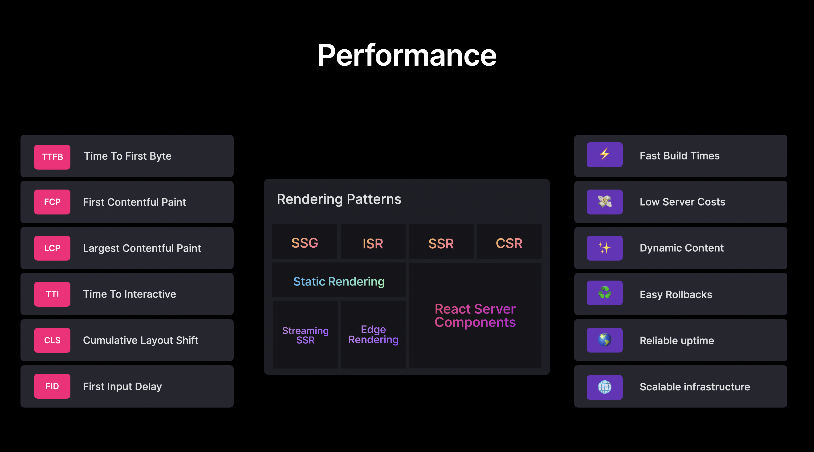
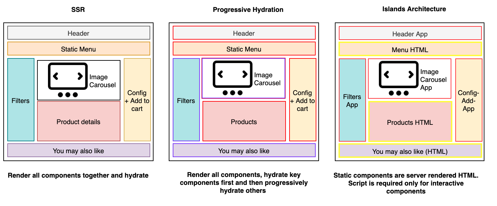

Earlier this year, I started to read the online book [*Learning Patterns* by Lydia Hallie and Addy Osmani](https://www.patterns.dev/). It's a good book for mid-level developers, which has comprehensive coverage of design and development patterns with perspectives from Object Oriented Design to rendering mechanisms, to performance best practices, with a focus on Javascript & React.js. 

This blog summarizes the first part of the book -- rendering patterns. Compare to other parts of the book, there is some refinement that needs to be done for this part. But it doesn’t prevent us to do a preview of the content and grasp the key idea behind them. So in this blog, I’m going to summarize the key takeaways from this section of the book.

This part of the book aims to provide a thorough review of all the rendering strategies, from client-side rendering to different variations of partial server-side rendering, to pure server-side rendering, with a focus on React eco-system. The book contains a lot of details about the implementations for each architecture, as well as the pros and cons that we need to consider as trade-offs when we architect our apps.

# Why Does It Matter?

The first question that we always want to answer is why does it matter? The answer in the book is: choosing the most suitable rendering patterns provides not only the optimal user experience in terms of Core Web Vitals (CWV) but also the optimal developer experience.

[Reference to image](https://www.patterns.dev/posts/rendering-introduction/#:~:text=Summarizing%20our%20expectations%2C%20we%20have%20now%20built%20quite%20a%20long%20list.%20But%2C%20if%20you%20choose%20the%20correct%20rendering%20pattern%2C%20you%20can%20get%20most%20of%20these%20benefits%20out%20of%20the%20box)

# What Are Rendering Patterns?

1. **Client Side Rendering (CSR)**
    
    Most of the React applications are client-side rendered. The entire app is loaded at the initial load.
    
    Pros:
    
    - CSP supports navigation without page refresh and provides a great user experience. CSP also provides a clear separation between client and server to developers.
    
    Cons: 
    
    - SEO consideration: additional work is required to make the site SEO friendly
    - Performance: The first paint experience can become bad while the size of JavaScript and CSS bundles increases.
    - Code maintainability: In some cases, the client and server may want to share similar logic. It is not easy to achieve this goal in client-side rendering.
    - Data fetching: Because data are mostly fetched in real-time after page load, the TTI can be
2. **Incremental Static Site Generation (iSSG)**
    
    The Incremental Static Generation (iSSG) pattern was introduced as an upgrade to SSG, to help solve the dynamic data problem and help static sites scale for large amounts of frequently changing data. iSSG allows you to update existing pages (through [stale-while-revalidate](https://web.dev/stale-while-revalidate/)) and add new pages (through lazy loading). 
    
    Pros:
    
    - Dynamic data: It can support dynamic data without rebuilding the site.
    - Speed: iSSG is at least as fast as SSG in terms of initial load.
    - Availability: A fairly recent version of any page will always be available online for users to access. Even if the regeneration fails in the background, the old version remains unaltered.
    - Ease of Distribution: Just like SSG sites, iSSG sites can also be distributed through a network of CDNs used to serve pre-rendered web pages.
3. **Static Site Generation (SSG)**
    
    Static rendering or static site generation (SSG) delivers pre-rendered HTML content, which was generated at build time, to the client.
    
    Pros:
    
    - SSG provides great performance as it cuts down the processing time on both client and server
    - SSG also supports SEO
    
    Cons:
    
    - A large number of HTML files: Since all the html files need to be generated at build time, as the website scales, chances are high that the number of html pages to be built will increase over time. Maintaining a large number of html files can be challenging.
    - Hosting dependency: For an SSG site to be super-fast and respond quickly, the hosting platform used to store and serve the HTML files should also be good. Superlative performance is possible if a well-tuned SSG website is hosted right on multiple CDNs to take advantage of edge-caching.
    - Dynamic Content: SSG does not fit the need when website content is dynamic.
4. **Progressive Hydration**
    
    With classic SSR, despite that TTI has been saved due to a smaller JavaScript bundle and runtime, the hydration process still blocks TTI in some circumstances. To solve this problem, Progressive hydration was introduced. Progressive hydration allows us to only hydrate components based on a certain condition.
    
    Pros:
    
    - Promotes code splitting
    - Allows on-demand loading for infrequently used parts of the page
    - Reduces bundle size
    
    Cons:
    
    - May not be suitable for dynamic apps where every element on the screen is available to the user and needs to be made interactive on load.
5. **Streaming Server Side Rendering**
    
    Streaming implies chunks of HTML are streamed from the node server to the client as they are generated. As the client starts receiving "bytes" of HTML earlier even for large pages, the TTFB is reduced and relatively constant. All major browsers start parsing and rendering streamed content or the partial response earlier. As the rendering is progressive, it results in a fast FP and FCP.
    
    Pros:
    
    - Performance improvement: FP, FCP, and TTFB are improved with this strategy
    - Handling of backpressure: Streaming responds well to network backpressure or congestion and can result in responsive websites even under challenging conditions
    - Supports SEO
    
    Cons:
    
    - Sometimes it is not easy to implement streaming, especially when migrating from a non-streaming server-side rendering architecture.
6. **Server-Side Rendering With Selective Hydration**
    
    Together with streaming html, selective hydration provides a new approach to lazy load components. Selective Hydration lets you start hydrating your app as early as possible before the rest of the HTML and the JavaScript code are fully downloaded. It also prioritizes hydrating the parts the user is interacting with, creating an illusion of instant hydration.
    
7. **Classic Server Side Rendering (SSR)**
    
    Pros:
    
    - Lesser JavaScript leads to quicker FCP (First Content Paint) and TTI (Time To Interactive)
    - Provides additional budget for client-side JavaScript
    - SEO enabled by default
    
    Cons:
    
    - Slow TTFB (Time To First Byte)
    - Some interactions require full page reloads

# React Server Side Component

React server component is the future add-on of React library, which is being actively worked on by React team. Although it is not generally available yet, there is some early adaption being discussed and investigated among the community. 

To summarize a **[good explanation](https://news.ycombinator.com/item?id=25499171)** of the differences between Next.js SSR and Server Components from Dan Abramov:

- **Code for Server Components is never delivered to the client.** In many implementations of SSR using React, component code gets sent to the client via JavaScript bundles anyway. This can delay interactivity.
- **Server components enable access to the back-end from anywhere in the tree.** When using Next.js, you're used to accessing the back-end via getServerProps() which has the limitation of only working at the top-level page. Random npm components are unable to do this.
- **Server Components may be refetched while maintaining the Client-side state inside of the tree.** This is because the main transport mechanism is much richer than just HTML, allowing the refetching of a server-rendered part (e.g such as a search result list) without blowing away state inside (e.g search input text, focus, text selection)

Some of the early integration work for Server Components will be done via a webpack plugin which:

- Locates all Client components
- Creates a mapping between IDs => chunk URLs
- A Node.js loader replaces imports to Client components with references to this map.
- Some of this work will require deeper integrations (e.g with pieces such as Routing) which is why getting this to work with a framework like Next.js will be valuable.

# Islands Architecture

Islands architecture is becoming more and more popular recently. The general idea behind it is best described in below diagram:

Islands are a component-based architecture that suggests a compartmentalized view of the page with static and dynamic islands. The static regions of the page are pure non-interactive HTML and do not need hydration. The dynamic regions are a combination of HTML and scripts capable of rehydrating themselves after rendering.

Pros:

- Performance: Reduces the amount of JavaScript code shipped to the client.
- SEO supportive
- Prioritizes important content
- Accessibility: The use of standard static HTML links to access other pages helps to improve the accessibility of the website.
- Component-based: The architecture offers all advantages of component-based architecture, such as reusability and maintainability.

Cons:

- The only options available to developers to implement Islands are to use one of the few frameworks available or develop the architecture yourself. Migrating existing sites to Astro or Marko would require additional efforts.
- Besides Jason's initial post, there is little discussion available on the idea.
- **[New frameworks](https://github.com/bensmithett/tropical-utils/tree/main/packages/tropical-islands)** claim to support the Islands architecture making it difficult to filter the ones which will work for you.
- The architecture is not suitable for highly interactive pages like social media apps which would probably require thousands of islands.

# Takeaways

Though islands architecture is being discussed more and more, after reading the book and some other learning materials, it sounds like using Streaming HTML + Selective hydration solves most performance/UX challenges that have been complained about for a long time. Use these two strategies together:

- **You no longer have to wait for all the data to load on the server before sending HTML.** Instead, you start sending HTML as soon as you have enough to show a shell of the app, and stream the rest of the HTML as it’s ready.
- **You no longer have to wait for all JavaScript to load to start hydrating.** Instead, you can use code splitting together with server rendering. The server HTML will be preserved, and React will hydrate it when the associated code loads.
- **You no longer have to wait for all components to hydrate to start interacting with the page.** Instead, you can rely on Selective Hydration to prioritize the components the user is interacting with, and hydrate them early.

**References:**

[https://web.dev/rendering-on-the-web/](https://web.dev/rendering-on-the-web/) 

[https://github.com/reactwg/react-18/discussions/37](https://github.com/reactwg/react-18/discussions/37)